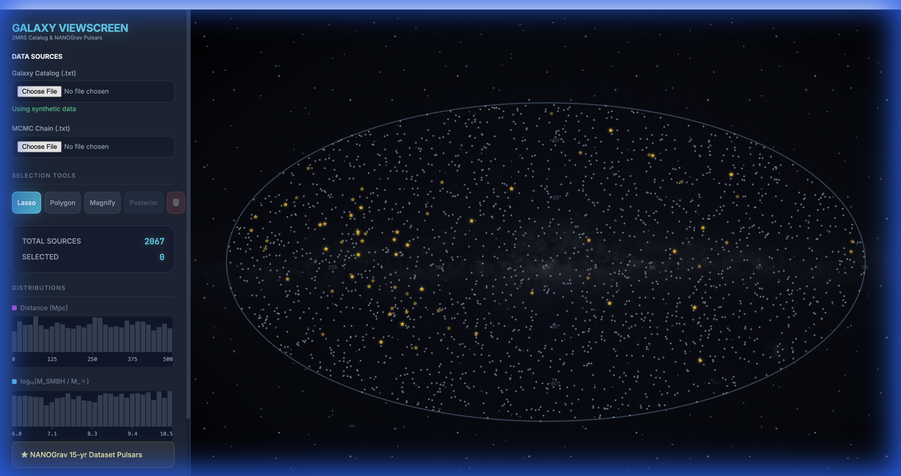

# 🌌 Galaxy Catalog Viewscreen

An interactive celestial map visualization tool for exploring galaxy catalogs and pulsar data using a Mollweide projection.



## Features

- **Mollweide Projection Map** — View galaxy and pulsar positions on an all-sky projection with RA/Dec coordinate grid
- **Interactive Selection** — Click and drag to lasso-select galaxies, with real-time statistics
- **Dynamic Histograms** — Live-updating distributions of distance and mass for selected galaxies
- **Hover Tooltips** — Detailed information displayed on mouse hover over any data point
- **Animated Starfield** — Optional CSS-animated background with twinkling stars and Milky Way panorama
- **Responsive Design** — Canvas automatically resizes to fill the viewport

## Data Sources

### Built-in: NANOGrav Pulsars
The app comes pre-loaded with pulsar timing array data from the NANOGrav collaboration.

### Custom Galaxy Catalogs
Upload your own galaxy catalog in tab-separated format with columns:
- `pgc` — Galaxy ID
- `RAJ2000` — Right Ascension (degrees)
- `DEJ2000` — Declination (degrees)  
- `Dist` — Distance (Mpc)
- `Kmag` — K-band magnitude
- `Mstar` — Stellar mass (solar masses)

### Chain Files
Upload MCMC chain files to visualize CW posterior distributions from gravitational wave analysis.

## Installation

### Prerequisites
- Python 3.8+
- Conda (recommended) or pip

### Setup

```bash
# Clone the repository
git clone https://github.com/yourusername/galaxy-catalog-viewscreen.git
cd galaxy-catalog-viewscreen

# Create conda environment
conda create -n galaxy-viewer python=3.10
conda activate galaxy-viewer

# Install dependencies
pip install streamlit

# Run the app
streamlit run galaxy_app.py
```

The app will open in your browser at `http://localhost:8501`.

## Usage

### Loading Data
1. Click **"Choose galaxy catalog file"** to upload a galaxy catalog
2. Click **"Choose chain file"** to upload MCMC chain data (optional)
3. Watch the progress bar as data loads

### Exploring the Map
- **Pan**: The map displays all data in the Mollweide projection
- **Select**: Click and drag to draw a lasso selection around galaxies
- **Hover**: Mouse over any point to see detailed information
- **Clear**: Click the "CLEAR SELECTION" button to reset

### Controls
| Control | Description |
|---------|-------------|
| Pulse Dilation | Speed of pulsar twinkle animation |
| Starfield Toggle | Show/hide animated star background |
| Milky Way Toggle | Show/hide ESO Milky Way panorama |

## Technology Stack

- **[Streamlit](https://streamlit.io/)** — Python web app framework
- **HTML5 Canvas** — High-performance 2D rendering
- **Vanilla JavaScript** — No external dependencies for the frontend
- **CSS3 Animations** — Smooth starfield and glow effects

## Project Structure

```
galaxy-catalog-viewscreen/
├── galaxy_app.py      # Main Streamlit application (Python + embedded HTML/JS/CSS)
├── tab2.txt           # Sample 2MRS galaxy catalog data
├── screenshot.png     # App screenshot
└── README.md          # This file
```

## Credits

**Developed by:**
- Polina Petrov
- Celine Mang  
- Stephen Taylor

**Acknowledgments:**
- Participants of the 2024 VIPER Summer School
- Supported by NSF Award #2307719

## License

MIT License — See [LICENSE](LICENSE) for details.

---

*Built with ❤️ for the astronomy community*
